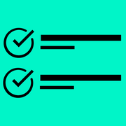

<p align="center">
     
</p>
<h1 align="center">Idea Checklist</h3>
<p align="center">A simple and efficient software for Tech YouTube Streamers to manage ideas during the live stream</p>
<p align="center">
     <a href="https://github.com/ArsenTech/idea-checklist/issues/new?assignees=&labels=&template=bug_report.md&title=">Report bug</a>
     &nbsp;&middot;&nbsp;
     <a href="https://github.com/ArsenTech/idea-checklist/issues/new?assignees=&labels=&template=feature_request.md&title=">Request Feature</a>
</p>

![version][version-shield]
[![Contributors][contributors-shield]][contributors-url]
[![Forks][forks-shield]][forks-url]
[![Stargazers][stars-shield]][stars-url]
[![Issues][issues-shield]][issues-url]
[![project_license][license-shield]][license-url]
[![downloads][downloads-shield]][downloads-url]
[![build-status][status-shield]][status-url]
![commits since latest release][commits-since-shield]
![GitHub Created At][created-at-shield]
![GitHub repo size][repo-size-shield]

<details>
     <summary>Table of Contents</summary>
     <ol>
          <li>
               <a href="#about">About</a>
               <ul>
                    <li><a href="#features">Features</a></li>
                    <li><a href="#built-with">Built With</a></li>
                    <li><a href="#download">Download</a></li>
               </ul>
          </li>
          <li><a href="#usage">Usage</a></li>
          <li><a href="#versioning">Versioning</a></li>
          <li><a href="#contributing">Contributing</a></li>
          <li><a href="#star-history">Star History</a></li>
     </ol>

</details>

## About
A simple and efficient software for Tech YouTube Streamers to manage Malware Test and Windows Test Ideas during the live stream. It helps you organize and track ideas by categorizing them into different lists based on their status.
### Features
- **Idea Management**: Easily track and organize ideas mentioned during the live stream.
- **Completed Ideas List**: Move ideas to this list when they have been implemented.
- **"Saved for Later" List**: Store ideas here if the viewer who suggested them is absent.
- **Bulk Add Ideas**: Quickly add multiple ideas from text input.
- **Lightweight & Fast**: Built with Tauri, ensuring high performance and low resource usage.
- **Theme Customization**: This App has a Light Theme, Dark Theme, and a Terminal Theme for more tech experience.
- **Auto Save Feature**: Every Time You Manage The Idea, It Will Automatically Save To The Local Storage.
### Built With
- [![Tauri][tauri-shield]][tauri-url]
- [![React][react-shield]][react-url]
- [![ShadCN UI][shadcn-shield]][shadcn-url]
- [![Tailwind CSS][tailwind-shield]][tailwind-url]
- [![Typescript][typescript-shield]][typescript-url]
- [![Vite][vite-shield]][vite-url]
- [![Rust][rust-shield]][rust-url]
### Download
You can find the latest stable version of Idea Checklist right here

[![GitHub Downloads (all assets, latest release)][download-shield]][download-url]

## Usage
### 1. Adding an Idea:
- Click On The Plus Button, select "Add an Idea" (Or By Going To File -> Add an Idea), Type The Viewer Name and Idea, and Click On the "Add an Idea" Button.
- To Add Multiple Ideas At Once, Click On The Plus Button, select "Bulk add Ideas" (Or By Going To File -> Bulk Add Ideas), Type Some Ideas From a Notepad Like This:
```txt
Name
Idea

Name
Idea (later)
...
```
- Then click on the "Bulk add Ideas" Button.

### 2. Managing Ideas:
- When an Idea is completed, move it to the Completed Ideas List By Clicking On The Checkbox Icon.
- If The Viewer is absent, move it to the "Save For Later" list by Clicking On the Clock icon.
- If The Viewer Wants to Change The Idea, Click On The Edit Button, Change Some Values, and Click On "Edit an Idea" To Save The Changes.

### 3. Reviewing And Organizing:
- Review Completed Ideas For Reference.
- Revisit Saved Ideas When The Respective Viewer Is Available and Returned To The Stream.

## Versioning
This website follows [Semantic Versioning](https://semver.org/). You can view the full [Changelog][changelog-url] for details on each website version.

## Contributing
Contributions are Always Welcome! Please read both [Code of Conduct][code-of-conduct-url] and [CONTRIBUTING.md][contributing-url] before contributing.
### Top Contributors
[![Top Contributors][top-contributors]][contributors-url]

## Star History
[![Star History Chart][star-history-chart]][star-history-url]

## Support And Follow
[![YouTube][yt-shield]][yt-url]
[![Patreon][patreon-shield]][patreon-url]
[![Codepen][codepen-shield]][codepen-url]
[![DeviantArt][deviantart-shield]][deviantart-url]
[![Odysee][odysee-shield]][odysee-url]
[![Scratch][scratch-shield]][scratch-url]

> GitHub [@ArsenTech][github-url] &nbsp;&middot;&nbsp;
> YouTube [@ArsenTech][yt-url] &nbsp;&middot;&nbsp;
> Patreon [ArsenTech][patreon-url] &nbsp;&middot;&nbsp;
> [ArsenTech's Website][website-url]

<!-- Markdown Links -->
[star-history-chart]: https://api.star-history.com/svg?repos=ArsenTech/idea-checklist&type=Date
[star-history-url]: https://api.star-history.com/svg?repos=ArsenTech/idea-checklist&type=Date
[contributors-shield]: https://img.shields.io/github/contributors/ArsenTech/idea-checklist.svg?style=for-the-badge&color=%2322b455
[contributors-url]: https://github.com/ArsenTech/idea-checklist/graphs/contributors
[top-contributors]: https://contrib.rocks/image?repo=ArsenTech/idea-checklist
[forks-shield]: https://img.shields.io/github/forks/ArsenTech/idea-checklist.svg?style=for-the-badge&color=%2322b455
[forks-url]: https://github.com/ArsenTech/idea-checklist/network/members
[stars-shield]: https://img.shields.io/github/stars/ArsenTech/idea-checklist.svg?style=for-the-badge&color=%2322b455
[stars-url]: https://github.com/ArsenTech/idea-checklist/stargazers
[issues-shield]: https://img.shields.io/github/issues/ArsenTech/idea-checklist.svg?style=for-the-badge
[issues-url]: https://github.com/ArsenTech/idea-checklist/issues
[license-shield]: https://img.shields.io/github/license/ArsenTech/idea-checklist?color=%2322b455&style=for-the-badge
[license-url]: https://github.com/ArsenTech/idea-checklist/blob/main/LICENSE.md
[version-shield]: https://img.shields.io/github/package-json/v/ArsenTech/idea-checklist?style=for-the-badge
[downloads-shield]: https://img.shields.io/github/downloads/ArsenTech/idea-checklist/total?style=for-the-badge&label=Total%20Downloads&color=%2322b455
[downloads-url]:https://github.com/ArsenTech/idea-checklist/releases
[status-shield]: https://img.shields.io/github/actions/workflow/status/ArsenTech/idea-checklist/main.yml?style=for-the-badge&color=%2322b455
[status-url]: https://github.com/ArsenTech/idea-checklist/actions/workflows/main.yml
[commits-since-shield]: https://img.shields.io/github/commits-since/ArsenTech/idea-checklist/latest?style=for-the-badge&color=%2322b455&label=Commits%20since%20latest%20version
[created-at-shield]: https://img.shields.io/github/created-at/ArsenTech/idea-checklist?style=for-the-badge
[repo-size-shield]: https://img.shields.io/github/repo-size/ArsenTech/idea-checklist?style=for-the-badge
[download-shield]: https://img.shields.io/github/downloads/ArsenTech/idea-checklist/latest/total?style=for-the-badge&label=Download&color=%2322b455
[download-url]: https://github.com/ArsenTech/idea-checklist/releases/latest
[code-of-conduct-url]: https://github.com/ArsenTech/idea-checklist/blob/main/CODE_OF_CONDUCT.md
[contributing-url]: https://github.com/ArsenTech/idea-checklist/blob/main/CONTRIBUTING.md
[changelog-url]: https://github.com/ArsenTech/idea-checklist/blob/main/CHANGELOG.md
[website-url]: https://arsentech.github.io

<!-- Languages -->
[tauri-shield]: https://img.shields.io/badge/Tauri-FFC131?style=for-the-badge&logo=Tauri&logoColor=white
[tauri-url]: https://tauri.app/
[react-shield]: https://img.shields.io/badge/React-20232A?style=for-the-badge&logo=react&logoColor=61DAFB
[react-url]: https://react.dev/
[shadcn-shield]: https://img.shields.io/badge/shadcn%2Fui-000000?style=for-the-badge&logo=shadcnui&logoColor=white
[shadcn-url]: https://ui.shadcn.com/
[tailwind-shield]: https://img.shields.io/badge/Tailwind_CSS-38B2AC?style=for-the-badge&logo=tailwind-css&logoColor=white
[tailwind-url]: https://tailwindcss.com/
[typescript-shield]: https://img.shields.io/badge/TypeScript-007ACC?style=for-the-badge&logo=typescript&logoColor=white
[typescript-url]: https://www.typescriptlang.org/
[vite-shield]: https://img.shields.io/badge/Vite-B73BFE?style=for-the-badge&logo=vite&logoColor=FFD62E
[vite-url]: https://vite.dev/
[rust-shield]: https://img.shields.io/badge/Rust-000000?style=for-the-badge&logo=rust&logoColor=white
[rust-url]: https://rust-lang.org/

<!-- External Links -->
[yt-shield]: https://img.shields.io/badge/ArsenTech%20-222222.svg?&style=for-the-badge&logo=YouTube&logoColor=%23FF0000
[yt-url]:https://www.youtube.com/channel/UCrtH0g6NE8tW5VIEgDySYtg
[patreon-shield]:https://img.shields.io/badge/-ArsenTech-222222?style=for-the-badge&logo=patreon&logoColor=white
[patreon-url]:https://www.patreon.com/ArsenTech
[codepen-shield]: https://img.shields.io/badge/-ArsenTech-222222?style=for-the-badge&logo=codepen&logoColor=white
[codepen-url]: https://codepen.io/ArsenTech
[deviantart-shield]: https://img.shields.io/badge/-Arsen2005-222222?style=for-the-badge&logo=deviantart&logoColor=05cc46
[deviantart-url]: https://www.deviantart.com/arsen2005
[odysee-shield]: https://img.shields.io/badge/-ArsenTech-222222?style=for-the-badge&logo=odysee&logoColor=FA9626
[odysee-url]: https://odysee.com/@ArsenTech
[scratch-shield]: https://img.shields.io/badge/-ArsenTech-222222?style=for-the-badge&logo=scratch&logoColor=orange
[scratch-url]: https://scratch.mit.edu/users/ArsenTech/
[github-url]: https://github.com/ArsenTech
